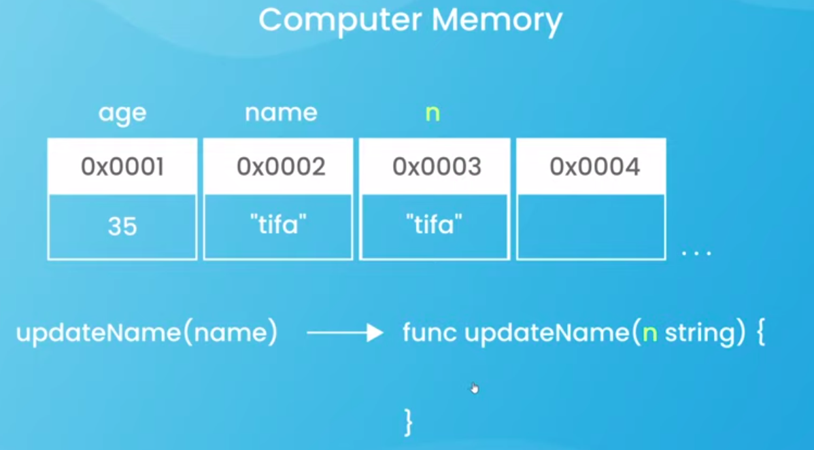
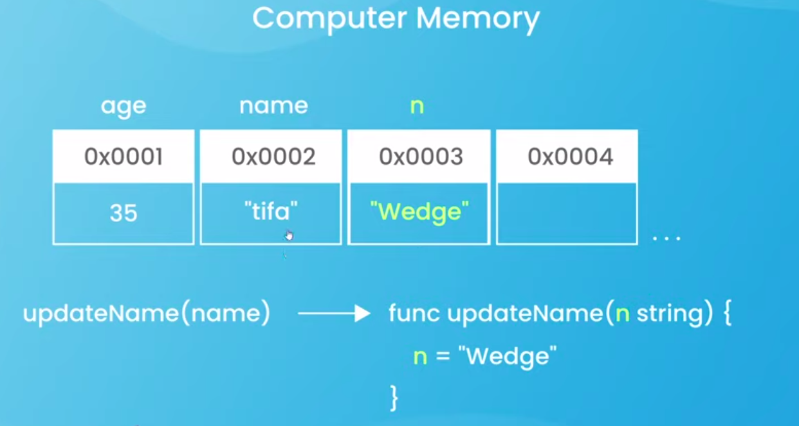
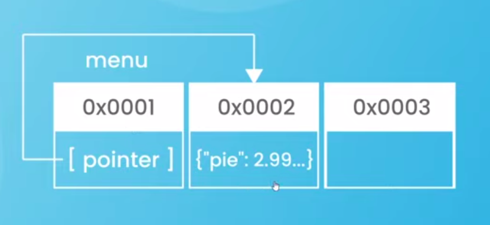
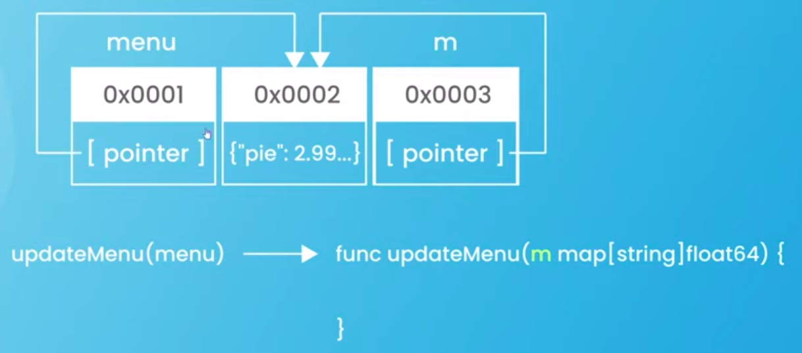
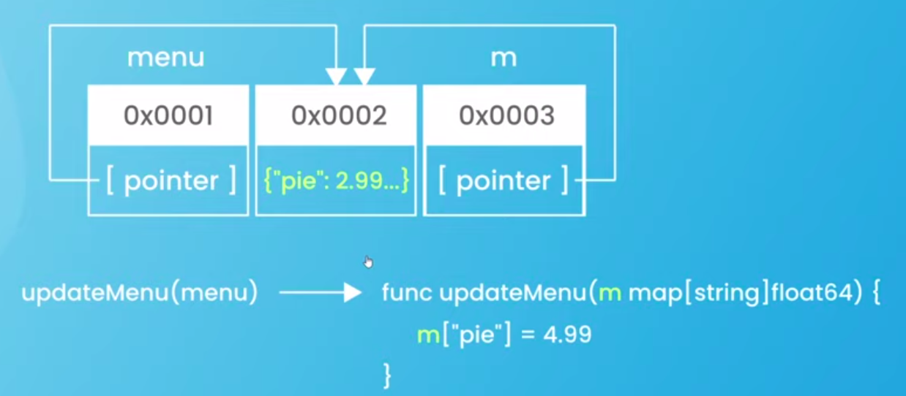

# Go (Golang) Basic Sandbox

**Go is a Pass-by-value language**

- Go makes "copies" of values when passed into functions
- Data types:

  | Group A (Non-Pointer Values) | Group B (Pointer Wrapper Values) |
  | :--------------------------- | :------------------------------- |
  | Strings                      | Slices                           |
  | Ints                         | Maps                             |
  | Floats                       | Functions                        |
  | Booleans                     |                                  |
  | Arrays                       |                                  |
  | Structs                      |                                  |

  ## Group A example code:

  ```go
  import "fmt"

  func updateName(x string) {
    x = "wedge"
  }

  func main() {
    name := "tifa"

    updateName(name)

    fmt.Println(name)
  }
  ```

  the output is `tifa`, because every variable passed to the function, Go create a copy of the variable.
  so x in the func `updateName` is the copy of the name at main func, not the original variable, so when it updated inside the `updateName` func, the copied is updating, not the original var.

  So, println inside func main is printing out the original variable, not the copy that has been updated.

  ### Under the hood

  Before update:

  

  After update:

  

  To update the original variable from the update action inside other func, the func must return the updated value, and the original variable must reasign to the returned value

  ```go
  package main

  import "fmt"

  func updateName(x string) string {
    x = "wedge"
    return x
  }

  func main() {
    name := "tifa"

    name = updateName(name)

    fmt.Println(name)
  }
  ```

  and the output is `wedge`

  ***

  ## Group B example code:

  ```go
  package main

  import "fmt"

  func updateMenu(y map[string]float64) {
    y["coffee"] = 2.99
  }

  func main() {
    // group B types -> slices, maps, functions
    menu := map[string]float64{
      "pie":       5.95,
      "ice cream": 3.99,
    }

    updateMenu(menu)
    fmt.Println(menu)
  }
  ```

  the output is:

  ```bash
  map[coffee:2.99 ice cream:3.99 pie:5.95]
  ```

  the original map, is updated, even though the update action is fire inside the `updateMenu` func

  ### Under the hood

  When a group B variable is declare, Go does two things:

  - first, store the underlying data in memory in its own block
  - second, store a value which contain other information (wrapper), incluiding pointer to another block, the variable (group B) name is associated with the second memory block and it point to another (first) memory block/location for its data.

  When the group B variable is use, Go find the second memory block (pointer contain), and sees the pointer to other (first) memory block and read and write to the its underlying data

  

  When the group B variable is passed as an argument to other func:

  - first, go still does make a copy the variable (Go always make a copy), but it's copying the value stored inside the second memory block where the pointer or the reference is stored, not the underlying data
  - second, the wrapper copy contain the same pointer and pointing to the same underlying data in the first memory block

  

  So, when the value updating, Go looks at the copy variable (pointer) in the memory, it sees that it points to the other memory, it updates the value in that block, so it changes the original value

  

  So, group A variable is called **Non-Pointer Values**

  and group B variable is called **Pointer Wrapper Values**
