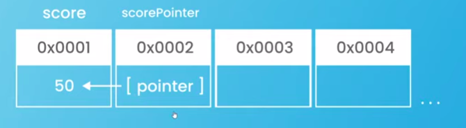

# Go (Golang) Basic Sandbox

**Lesson Resource and Repository:**

https://www.youtube.com/playlist?list=PL4cUxeGkcC9gC88BEo9czgyS72A3doDeM

https://github.com/iamshaunjp/golang-tutorials

**Go is a Pass-by-value language**

- Go makes "copies" of values when passed into functions
- Data types:

  | Group A (Non-Pointer Values) | Group B (Pointer Wrapper Values) |
  | :--------------------------- | :------------------------------- |
  | Strings                      | Slices                           |
  | Ints                         | Maps                             |
  | Floats                       | Functions                        |
  | Booleans                     |                                  |
  | Arrays                       |                                  |
  | Structs                      |                                  |

  ## Group A example code:

  ```go
  import "fmt"

  func updateName(x string) {
    x = "wedge"
  }

  func main() {
    name := "tifa"

    updateName(name)

    fmt.Println(name)
  }
  ```

  the output is `tifa`, because every variable passed to the function, Go create a copy of the variable.
  so x in the func `updateName` is the copy of the name at main func, not the original variable, so when it updated inside the `updateName` func, the copied is updating, not the original var.

  So, println inside func main is printing out the original variable, not the copy that has been updated.

  ### Under the hood

  Before update:

  

  After update:

  

  To update the original variable from the update action inside other func, the func must return the updated value, and the original variable must reasign to the returned value

  ```go
  package main

  import "fmt"

  func updateName(x string) string {
    x = "wedge"
    return x
  }

  func main() {
    name := "tifa"

    name = updateName(name)

    fmt.Println(name)
  }
  ```

  and the output is `wedge`

  ***

  ## Group B example code:

  ```go
  package main

  import "fmt"

  func updateMenu(y map[string]float64) {
    y["coffee"] = 2.99
  }

  func main() {
    // group B types -> slices, maps, functions
    menu := map[string]float64{
      "pie":       5.95,
      "ice cream": 3.99,
    }

    updateMenu(menu)
    fmt.Println(menu)
  }
  ```

  the output is:

  ```bash
  map[coffee:2.99 ice cream:3.99 pie:5.95]
  ```

  the original map, is updated, even though the update action is fire inside the `updateMenu` func

  ### Under the hood

  When a group B variable is declare, Go does two things:

  - first, store the underlying data in memory in its own address
  - second, store a value which contain other information (wrapper), incluiding pointer to another address, the variable (group B) name is associated with the second memory address and it point to another (first) memory address/address for its data.

  When the group B variable is use, Go find the second memory address (pointer contain), and sees the pointer to other (first) memory address and read and write to the its underlying data

  

  When the group B variable is passed as an argument to other func:

  - first, go still does make a copy the variable (Go always make a copy), but it's copying the value stored inside the second memory address where the pointer or the reference is stored, not the underlying data
  - second, the wrapper copy contain the same pointer and pointing to the same underlying data in the first memory address

  

  So, when the value updating, Go looks at the copy variable (pointer) in the memory, it sees that it points to the other memory, it updates the value in that address, so it changes the original value

  

  So, group A variable is called **Non-Pointer Values**

  and group B variable is called **Pointer Wrapper Values**

  ## Pointers

  We can add manually pointer to non-pointer values (group A data type), pointer will have different memory address from the pointed data.

  

  Pointers is just pointed to other memory address, and the way we get a pointer to a variable's memory address is by placing an ampersand (&) in front of it

  To get/set the pointed variable we can use dereference operator (\*) in front of the variable that store pointer

  ```go
  func main() {
    name := "tifa"

    fmt.Println("memory address of name is: ", &name) // get a pointer to the memory address of the name variable

    m := &name // m is storing pointer (memory address) of name var, and has its own memory address

    fmt.Println("memory address: ", m) // memory address:  0xc00009e220
    fmt.Println("value at memory address: ", *m) // using dereference operator to get the value at pointer that storing at m

  }
  ```

  Pointer can pass into function (copied the pointer with same pointed variable memory address), and the pointed varible can get/set with dereference so the pointed variable is mutable

  ```go
  func updateName(x *string) { // data type with asterisk is mean it's receive the pointer of any data type pointed variable
    *x = "wedge" // dereference the pointer to get/set the value
  }

  func main() {
    name := "tifa"

    m := &name // m is storing pointer (memory address) of name var, and has its own memory address

    fmt.Println(name) // output: tifa

    updateName(m) // pass the pointer

    fmt.Println(name) // output: wedge

  }
  ```

  Before update:

  

  After update:

  

## Receiver Function with Pointers

When we want to make function/method struct associated to update the struct value, the receiver function should receive struct pointer.

**RULE OF THUMB, WHENEVER CALLING A METHOD/FUNCTION WHERE UPDATING THE VALUE, THE FUNCTION SHOULD RECEIVE A POINTER**

**STRUCT POINTERS ARE AUTOMATICALLY DEREFERENCE**

```go
// update tip
func (b *bill) updateTip(tip float64) {
	b.tip = tip // * updating struct value doesn't need dereference as long as the receiver function receive the struct pointer
}

// add an item to the bill
func (b *bill) addItem(name string, price float64) {
	b.items[name] = price
}
```

**USE POINTER AT EVERY RECEIVER FUNCTION CAN DECREASE MEMORY USAGE, BECAUSE GO WILL ALWAYS COPYING THE ARGUMENT AT EVERY FUNCTION CALL (INVOKE)**


## Using Empty Interface

Empty interface (interface{}) is the top level of any data type.

Because the interface have no any methods declared so all data type is part of empty interface.

So, interface{} is equal to all data type

The advantage of using interface{} is we can declared arrays, slices, functions and maps that contains or receive, return all data type

**Example:**

```go
anyElementArrayType := [4]interface{}{"string", 5, 3.7, true}

anyElementSliceType := []interface{}{"string", 5, 3.7, true}

func anyParamsType(a interface{}) interface{} {
	return a
}

anyMapPropsType := map[interface{}]interface{}{
  "soup":           4.99,
  4:            "string",
  1.3:          "6.99",
  "coffee pudding": true,
}
```